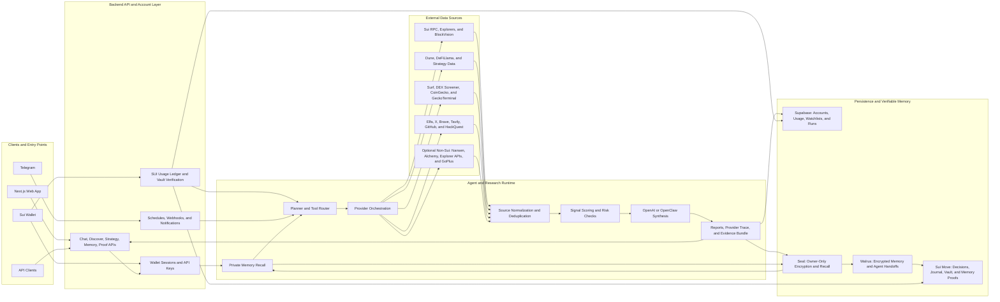

# Langclaw AI Sui

Langclaw is a Sui-first AI alpha, data, and strategy workspace with private,
verifiable agent memory. It helps users analyze smart-money activity, liquidity
anomalies, protocol momentum, and holder flows, then records source-backed agent
decisions and strategy proofs on Sui.

Private memories are encrypted with Seal, stored on Walrus, and linked to
metadata-only proofs on Sui. The current product is analysis-first: it does not
custody user assets, sign swaps, or execute live-funds trades.

## Repositories

**Organization:** [Langclaw-AI-SUI-Ecosystem](https://github.com/Langclaw-AI-SUI-Ecosystem)

**Live app:** [langclaw-sui-walrus.vercel.app](https://langclaw-sui-walrus.vercel.app)

| Repository | Stack | Purpose |
| --- | --- | --- |
| [frontend](https://github.com/Langclaw-AI-SUI-Ecosystem/frontend) | Next.js, React, Sui dApp Kit, AI SDK | User workspace, Sui wallet flow, Intelligence, Usage, Watchlist, Strategy Lab, Proof Center, and private memory controls |
| [backend](https://github.com/Langclaw-AI-SUI-Ecosystem/backend) | Node.js, TypeScript, Supabase, OpenAI, OpenClaw | Agent research workflow, wallet/API auth, provider orchestration, usage ledger, automation, Walrus and Seal integration, and Sui proof anchoring |
| [move](https://github.com/Langclaw-AI-SUI-Ecosystem/move) | Sui Move | Decision registry, trading journal, usage vault, memory registry, and Seal access policy |
| [langclaw-sui-walrus](https://github.com/Langclaw-AI-SUI-Ecosystem/langclaw-sui-walrus) | Project index | Public entry point and mainnet deployment summary for the split codebase |

## Product Coverage

| Area | What users get |
| --- | --- |
| Sui Intelligence | Smart-money summaries, holder-flow analysis, liquidity anomaly detection, protocol momentum, risk notes, and transparent source gaps |
| Alpha Watchlist | Saved Sui intelligence signals for follow-up analysis |
| Strategy Lab | Dune-backed Sui liquidity momentum backtests and deterministic paper-trade proofs |
| Proof Center | On-chain agent decisions and strategy journal records |
| Private Memory | Wallet-owned memories encrypted with Seal, stored on Walrus, and recalled only after on-chain access-policy approval |
| SUI Usage Credits | SUI-backed application credits with verifiable deposits and authorized withdrawal requests |
| Automation | Scheduled monitoring, run history, in-app notifications, and Telegram integration |

## Data Sources

Langclaw routes each request to the providers that match its chain, topic, and
available credentials. Results are normalized into source cards, deduplicated,
scored, and returned with a `providerTrace` so unavailable or failed sources
remain visible instead of being silently replaced.

| Source | Data used by Langclaw | Availability |
| --- | --- | --- |
| Sui RPC and explorers | On-chain objects, transactions, events, balances, and proof verification | Core Sui infrastructure |
| BlockVision | Sui coin holders, concentration, whale labels, and holder snapshots | Sui-native smart-money analysis |
| Dune | Sui DEX trades, wallet accumulation flows, saved analytics queries, and Strategy Lab history | Configured query/API access |
| Surf | Crypto research, market context, discovery, and smart-money candidate signals | Primary premium provider when configured |
| Elfa | Social intelligence, project mentions, and narrative signals | Optional premium provider |
| Brave and Tavily | Web, documentation, news, and fallback research | Used according to configured search credentials |
| X | Public social posts and engagement signals | Direct API or search fallback |
| GitHub | Repository activity, project metadata, and builder signals | Configured token |
| HackQuest | Ecosystem project and builder-directory context | Public directory |
| DEX Screener | Token profiles, pair liquidity, volume, transactions, boosts, and pair discovery | Public market API |
| DeFiLlama | Protocol TVL, yields, fees, and ecosystem momentum | Public market API |
| CoinGecko and GeckoTerminal | Aggregated market data, token metadata, trending pools, and pool-level activity | Public or configured API access |
| Nansen | Labeled smart-money flows for Mantle in the current structured workflow | Optional non-Sui provider |
| Alchemy, explorer APIs, and GoPlus | Token metadata, transfers, balances, and security checks for explicitly supported non-Sui analysis | Optional; not the default Sui path |

Provider output is evidence, not ground truth by itself. Langclaw preserves
source URLs, timestamps, coverage gaps, and false-positive checks in the final
research payload.

## Architecture



### Research Data Flow

1. A wallet-authenticated request enters chat, discovery, strategy, or
   automation.
2. The planner preserves the requested Sui scope and selects relevant provider
   tools.
3. Providers run in parallel where possible; their output becomes normalized
   source cards and structured on-chain tool results.
4. Langclaw deduplicates evidence, scores signal quality, checks risks and false
   positives, and records provider failures as explicit source gaps.
5. OpenAI or OpenClaw synthesizes the final answer from the evidence bundle.
6. The backend returns deterministic `signals`, `report`, `alphaSignal`,
   `providerTrace`, usage metadata, and optional Sui proof metadata.

### Private Memory and Proof Flow

1. Langclaw discovers prior memory pointers from the owner's index and Sui
   metadata.
2. The encrypted blob is fetched from Walrus and Seal authorizes owner-only
   decryption.
3. Recalled context is injected into the new research run.
4. The resulting evidence artifact is encrypted with Seal and stored on Walrus.
5. Langclaw reads the blob back and verifies it before creating a public proof.
6. Only the content hash, Walrus references, Seal policy, run ID, and owner are
   recorded through the Sui Move `memory_registry`; plaintext remains private.

## Sui, Walrus, and Seal Proof Layer

Langclaw separates private data from public verification:

1. Agent memory is encrypted for the wallet owner using Seal.
2. The encrypted artifact is stored on Walrus.
3. Only content hashes, storage references, policy identifiers, and ownership
   metadata are recorded on Sui.
4. Recall requires the Seal access policy to approve the requesting wallet.

| Item | Mainnet value |
| --- | --- |
| Product chain | Sui mainnet |
| Langclaw Move package | [`0x7f3578ebe174b0343cd96391b2a1c75d5db4ad82c793650b3950bdb5634192e5`](https://suivision.xyz/package/0x7f3578ebe174b0343cd96391b2a1c75d5db4ad82c793650b3950bdb5634192e5) |
| Usage Vault shared object | [`0x816064d45dfe06194a973bce4b38a137365bbd6979c61b0d09435b7a443f3eff`](https://suivision.xyz/object/0x816064d45dfe06194a973bce4b38a137365bbd6979c61b0d09435b7a443f3eff) |
| Usage Vault AdminCap | [`0x21314b9534ca673cac1c79d6d1a63b9b0469d684504c974d3e8a5588873e8d09`](https://suivision.xyz/object/0x21314b9534ca673cac1c79d6d1a63b9b0469d684504c974d3e8a5588873e8d09) |
| Agent ID | `133` |
| Agent owner / recorder | [`0x4b635af81752a2bcdaeb908bd522173ad1c86a859a9c56ee59d3089c35e0a622`](https://suivision.xyz/account/0x4b635af81752a2bcdaeb908bd522173ad1c86a859a9c56ee59d3089c35e0a622) |
| Seal KeyServer | `0x86b608dcb3fcb9c629cfe6d865681977d1decb219a2eb98eb6058b87377feaf3` |
| Walrus Site object | `0x423a0cf7bfa109ed48ae6fae63eead7b7eae751b0885925b137bfd1d9e597d2b` |
| Package publish transaction | [`6kmuA94JsgM7uJ7MN32WEbWFMkF5rBuLUrUwFT4eTKED`](https://suivision.xyz/txblock/6kmuA94JsgM7uJ7MN32WEbWFMkF5rBuLUrUwFT4eTKED) |
| Vault setup transaction | [`ALvypw6EvadDXo4MCzgNEPgLJ8jES3rVLsWZHCnnqYVH`](https://suivision.xyz/txblock/ALvypw6EvadDXo4MCzgNEPgLJ8jES3rVLsWZHCnnqYVH) |

The Move package contains the `decision_registry`, `trading_journal`,
`usage_vault`, `memory_registry`, and `access_policy` modules.

## Demo Prompts

```text
Find smart-money accumulation on Sui
```

```text
Detect liquidity anomalies on Sui DEX pairs
```

```text
Rank Sui protocols by TVL and yield momentum
```

```text
Analyze holder flow and smart-money signals for a Sui token
```

## Safety and Scope

- Langclaw does not execute live trades or move user funds for trading.
- Strategy Lab paper trades are deterministic proof records, not exchange
  orders.
- SUI deposits fund internal application usage credits.
- Private memory content is never written to Sui in plaintext.
- Provider failures and unavailable evidence are surfaced as source gaps.
- Strong agent decisions and strategy outcomes can be anchored on Sui for
  public verification.

## Verification

Backend:

```bash
npm run typecheck
npm test
```

Frontend:

```bash
node --test tests/sui-wallet.test.mjs
pnpm typecheck
pnpm lint
pnpm build
```

Move:

```bash
sui move build
sui move test
```

Public entry point:

```text
https://langclaw-sui-walrus.vercel.app
```
